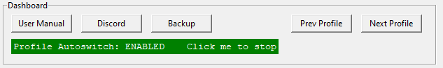
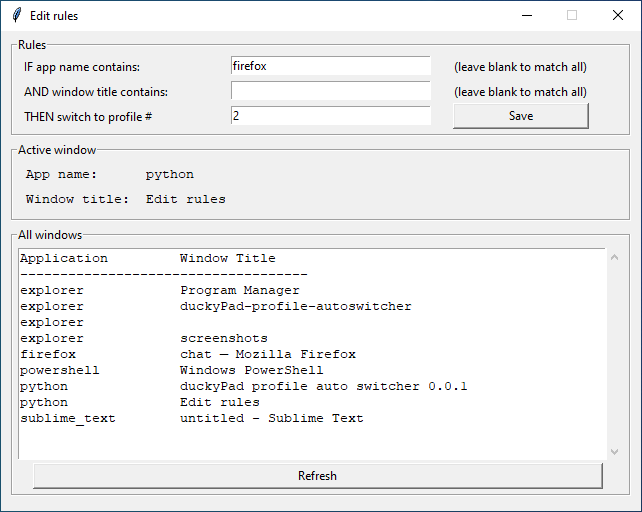

# duckyPad Profile Auto-switcher

[Get duckyPad](https://www.tindie.com/products/21984/) | [Official Discord](https://discord.gg/4sJCBx5) | [Project Main Page](https://github.com/dekuNukem/duckyPad)

This app allows your duckyPad to **switch profiles automatically** based on **current active window**.

⚠️ This app is currently under beta testing, there might be some bugs so use at your own risk!

## User Manual

### Download and launch the app

[Head over here](https://github.com/dekuNukem/duckyPad-profile-autoswitcher/releases) and download the latest release.

Extract the `.zip` file and launch the app by clicking `duckypad_autoprofile.exe`:

### "Untrusted App" Warnings

When trying to run the app, your system might complain about this software being untrusted. This is because I haven't had the code digitally signed, which costs hundreds of dollars a year.

Feel free to [review the code](https://github.com/dekuNukem/duckyPad-profile-autoswitcher/tree/master/src), you can also run `duckypad_autoprofile.py` directly with Python3. 

For Windows 10, click `More info` and then `Run anyway`.

### Using the app

Once plugged in, your duckyPad should show up in the `Connection` section.

If not, make sure you duckyPad [is running the latest firmware](https://github.com/dekuNukem/duckyPad/blob/master/firmware_updates_and_version_history.md) (0.18.0 and above).

You can use the buttons in `dashboard` section to open user manual, [discord](https://discord.gg/4sJCBx5), make backups, switch profiles, and start/pause profile autoswitching. 

Profile autoswitching is based on a list of *rules*.

Each rule contains **application name**, **window title**, and the **profile number** to switch to.

To create a new rule, click `New rule...` button:

A new window should pop up:

Type in the keywords you want to match in the text box. They are **case-insensitive**, leave blank to match all.

Current active window and a list of all windows are provided for reference.

Click `Save` when done.

-------

Back to the main window, duckyPad should now automatically switch profile once a rule is matched!

* Rules are evaluated **from top to bottom**, and **stops at first match**!

* Currently matched rule will turn green. 

* Select a rule and click `Move up` and `Move down` to rearrange its priority.

* Click `On/Off` button to enable/disable a rule.

That's pretty much it! Just leave the app running and duckyPad will do its thing!

## HID Command Protocol

Of course, now that duckyPad supports HID communication, you can write your own program to control it from PC!

Click me for details!

## Questions or Comments?

Please feel free to [open an issue](https://github.com/dekuNukem/duckypad/issues), ask in the [official duckyPad discord](https://discord.gg/4sJCBx5), DM me on discord `dekuNukem#6998`, or email `dekuNukem`@`gmail`.`com` for inquires.

