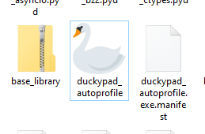
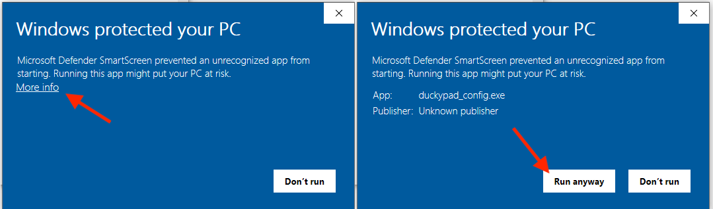
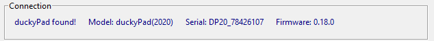
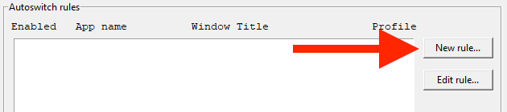
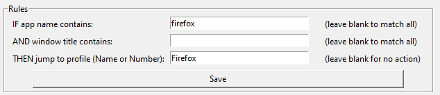
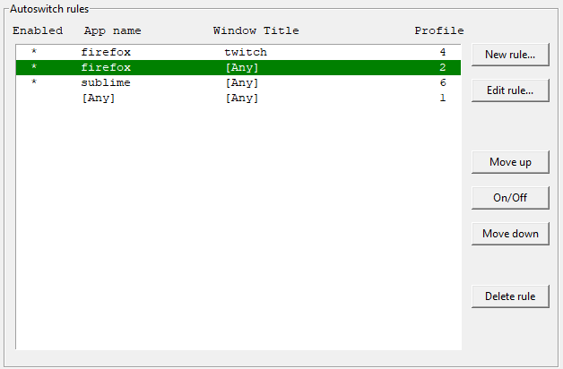

# duckyPad Profile Auto-switcher

[Get duckyPad](https://duckypad.com) | [Official Discord](https://discord.gg/4sJCBx5)

This app allows your duckyPad to **switch profiles automatically** based on **current active window**.

## User Manual

### Windows

[Download the latest release here](https://github.com/dekuNukem/duckyPad-profile-autoswitcher/releases/latest)

Extract the `.zip` file and launch the app by clicking `duckypad_autoprofile.exe`:

Windows might complain about unsigned app. Click `More info` and then `Run anyway`.

Feel free to [review the files](./src), or run the source code directly with Python.

### Mac

[See instruction here!](./linux_macos_notes.md)

### Linux

[Download the latest source release here](https://github.com/dekuNukem/duckyPad-profile-autoswitcher/releases/latest)

* Unzip & open a terminal at the directory
* Install tkinter: `sudo apt install python3-tk`
* Install dependencies: `sudo pip3 install -r requirements.txt`
* Launch the app: `sudo DUCKYPAD_UI_SCALE=1 python3 ./duckypad_config.py`
	* For High-DPI screens, adjust `DUCKYPAD_UI_SCALE` environment variable.

If window detection isn't working, you might need to implement your own `get_list_of_all_windows()` and `get_active_window()` in `get_window.py`.

### Using the App

Your duckyPad should show up in the `Connection` section.

Profile-Autoswitching is based on a list of *rules*.

To create a new rule, click `New rule...` button:

A new window should pop up:

Each rule contains **Application name**, **Window Title**, and the **Profile** to switch to.

**`App name`** and **`Window Title`**:

* Type in the keyword you want to match

* NOT case sensitive

**`Jump-to Profile`**:

* Can be Profile Number
	* 1-indexed
* Or Profile Name 
	* **duckyPad Pro ONLY** (for now)
	* Full Name
	* Case Sensitive

Click `Save` when done.

Current active window and a list of all windows are provided for reference.

-------

Back to the main window, duckyPad should now automatically switch profile once a rule is matched!

* Rules are evaluated **from top to bottom**, and **stops at first match**!

* Currently matched rule will turn green. 

* Select a rule and click `Move up` and `Move down` to rearrange priority.

* Click `On/Off` button to enable/disable a rule.

That's pretty much it! Just leave the app running and duckyPad will do its thing!

## Launch Autoswitcher on Windows Startup

The easiest way is to place a shortcut in the Startup folder:

* Select the autoswitcher app and press `Ctrl+C`.

* Press `Win+R` to open the `Run...` dialog, enter `shell:startup` and click OK. This will open the Startup folder.

* Right click inside the window, and click "Paste Shortcut". 

## HID Command Protocol

You can also write your own program to control duckyPad.

[Click me for details](HID_details.md)!

## Questions or Comments?

Please feel free to [open an issue](https://github.com/dekuNukem/duckypad/issues), ask in the [official duckyPad discord](https://discord.gg/4sJCBx5), DM me on discord `dekuNukem#6998`, or email `dekuNukem`@`gmail`.`com` for inquires.

